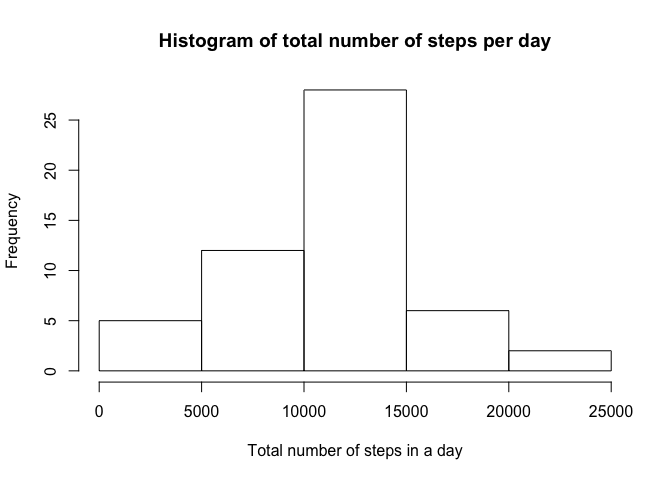
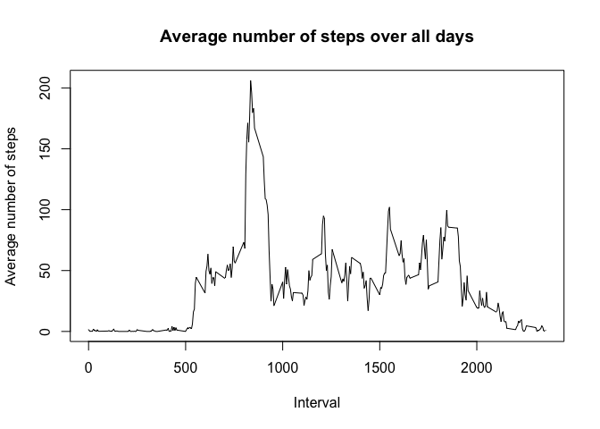
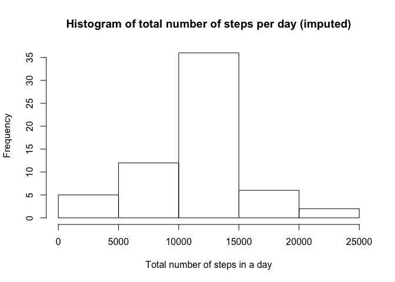
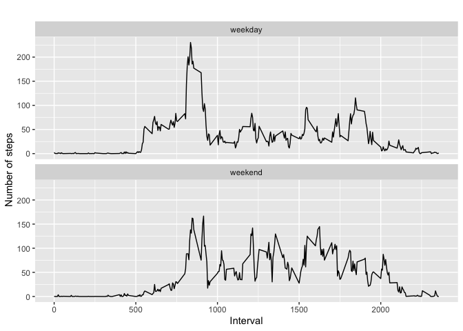

## Loading and preprocessing the data
# read.csv()

```r
library(dplyr)
```

```
## 
## Attaching package: 'dplyr'
```

```
## The following objects are masked from 'package:stats':
## 
##     filter, lag
```

```
## The following objects are masked from 'package:base':
## 
##     intersect, setdiff, setequal, union
```

```r
library(ggplot2)
myfile <- read.csv("./activity.csv",header = TRUE)
mydata <- myfile[ with (myfile, { !(is.na(steps)) } ), ]
head(mydata,20)
```

```
##     steps       date interval
## 289     0 2012-10-02        0
## 290     0 2012-10-02        5
## 291     0 2012-10-02       10
## 292     0 2012-10-02       15
## 293     0 2012-10-02       20
## 294     0 2012-10-02       25
## 295     0 2012-10-02       30
## 296     0 2012-10-02       35
## 297     0 2012-10-02       40
## 298     0 2012-10-02       45
## 299     0 2012-10-02       50
## 300     0 2012-10-02       55
## 301     0 2012-10-02      100
## 302     0 2012-10-02      105
## 303     0 2012-10-02      110
## 304     0 2012-10-02      115
## 305     0 2012-10-02      120
## 306     0 2012-10-02      125
## 307     0 2012-10-02      130
## 308     0 2012-10-02      135
```

```r
## What is mean total number of steps taken per day?
by_day <- group_by(mydata, date)
steps_by_day <- summarise(by_day, total = sum(steps))
steps_by_day
```

```
## # A tibble: 53 x 2
##    date       total
##    <fct>      <int>
##  1 2012-10-02   126
##  2 2012-10-03 11352
##  3 2012-10-04 12116
##  4 2012-10-05 13294
##  5 2012-10-06 15420
##  6 2012-10-07 11015
##  7 2012-10-09 12811
##  8 2012-10-10  9900
##  9 2012-10-11 10304
## 10 2012-10-12 17382
## # … with 43 more rows
```

```r
hist(steps_by_day$total, main="Histogram of total number of steps per day", 
     xlab="Total number of steps in a day")
```

<!-- -->

```r
summary(steps_by_day)
```

```
##          date        total      
##  2012-10-02: 1   Min.   :   41  
##  2012-10-03: 1   1st Qu.: 8841  
##  2012-10-04: 1   Median :10765  
##  2012-10-05: 1   Mean   :10766  
##  2012-10-06: 1   3rd Qu.:13294  
##  2012-10-07: 1   Max.   :21194  
##  (Other)   :47
```

```r
## The mean number of steps is 10766.
## The median of the total number of steps is 10765.
# preprocessing data for plot
steps_by_interval <- aggregate(steps ~ interval, mydata, mean)

# create a time series plot 
plot(steps_by_interval$interval, steps_by_interval$steps, type='l', 
    main="Average number of steps over all days", xlab="Interval", 
     ylab="Average number of steps")
```

<!-- -->

```r
max_steps_row <- which.max(steps_by_interval$steps)

# find interval with this max
steps_by_interval[max_steps_row, ]
```

```
##     interval    steps
## 104      835 206.1698
```

```r
## The interval is 835 with maximum average value of steps (206.1698)


## What is the average daily activity pattern?


## Imputing missing values
sum(is.na(myfile))
```

```
## [1] 2304
```

```r
## Total number of rows with NA’s is 2304.

data_imputed <- myfile
for (i in 1:nrow(data_imputed)) {
  if (is.na(data_imputed$steps[i])) {
    interval_value <- data_imputed$interval[i]
    steps_value <- steps_by_interval[
      steps_by_interval$interval == interval_value,]
    data_imputed$steps[i] <- steps_value$steps
  }
}

df_imputed_steps_by_day <- aggregate(steps ~ date, data_imputed, sum)
head(df_imputed_steps_by_day)
```

```
##         date    steps
## 1 2012-10-01 10766.19
## 2 2012-10-02   126.00
## 3 2012-10-03 11352.00
## 4 2012-10-04 12116.00
## 5 2012-10-05 13294.00
## 6 2012-10-06 15420.00
```

```r
hist(df_imputed_steps_by_day$steps, main="Histogram of total number of steps per day (imputed)", 
     xlab="Total number of steps in a day")
```

<!-- -->

```r
mean(df_imputed_steps_by_day$steps)
```

```
## [1] 10766.19
```

```r
median(df_imputed_steps_by_day$steps)
```

```
## [1] 10766.19
```

```r
mean(steps_by_day$total)
```

```
## [1] 10766.19
```

```r
median(steps_by_day$total)
```

```
## [1] 10765
```

```r
### Mean values stays the same but there is slight difference in median value.


## Are there differences in activity patterns between weekdays and weekends?
data_imputed['type_of_day'] <- weekdays(as.Date(data_imputed$date))
data_imputed$type_of_day[data_imputed$type_of_day  %in% c('Saturday','Sunday') ] <- "weekend"
data_imputed$type_of_day[data_imputed$type_of_day != "weekend"] <- "weekday"

# convert type_of_day from character to factor
data_imputed$type_of_day <- as.factor(data_imputed$type_of_day)

# calculate average steps by interval across all days
df_imputed_steps_by_interval <- aggregate(steps ~ interval + type_of_day, data_imputed, mean)

# create a plot
qplot(interval, 
      steps, 
      data = df_imputed_steps_by_interval, 
      type = 'l', 
      geom=c("line"),
      xlab = "Interval", 
      ylab = "Number of steps", 
      main = "") +
  facet_wrap(~ type_of_day, ncol = 1)
```

```
## Warning: Ignoring unknown parameters: type
```

<!-- -->
